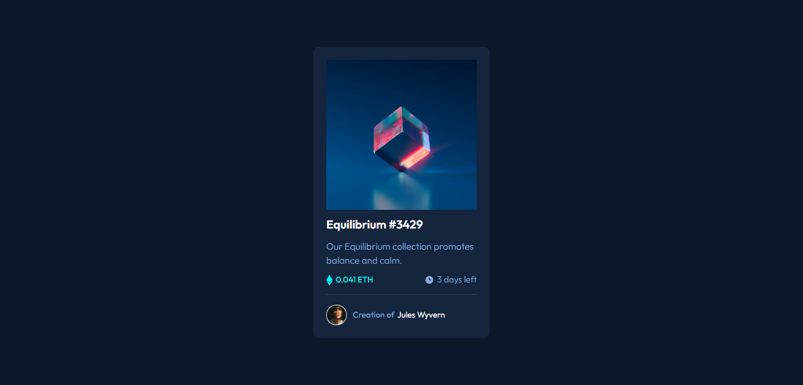

# Frontend Mentor - NFT preview card component solution

This is a solution to the [NFT preview card component challenge on Frontend Mentor](https://www.frontendmentor.io/challenges/nft-preview-card-component-SbdUL_w0U). Frontend Mentor challenges help you improve your coding skills by building realistic projects. 

## Table of contents

- [The challenge](#the-challenge)
- [Screenshot](#screenshot)
- [Links](#links)
- [My process](#my-process)
- [Built with](#built-with)
- [What I learned](#what-i-learned)
- [Continued development](#continued-development)
- [Useful resources](#useful-resources)
- [Author](#author)

### The challenge

Users should be able to:

- View the optimal layout depending on their device's screen size
- See hover states for interactive elements

### Screenshot

### Links

- Solution URL: [Add solution URL here](https://github.com/martinorue/nft-preview-card-component)
- Live Site URL: [Add live site URL here](https://martinorue.github.io/nft-preview-card-component)

## My process

In this challenge I wanted to apply the following topics that I have been studying: 

- mobile first approach
- BEM naming convention
- Semantic HTML
- Flexbox

### Built with

- Semantic HTML5
- CSS custom properties
- Flexbox
- Mobile-first workflow

### What I learned

- Image Hover Overlay

### Continued development

- Positioning
- Transforms
- Transitions
- Keyframes

### Useful resources

- [How TO - Image Hover Overlay](https://www.w3schools.com/howto/howto_css_image_overlay.asp) -

## Author

- Frontend Mentor - [@yourusername](https://www.frontendmentor.io/profile/martinorue)